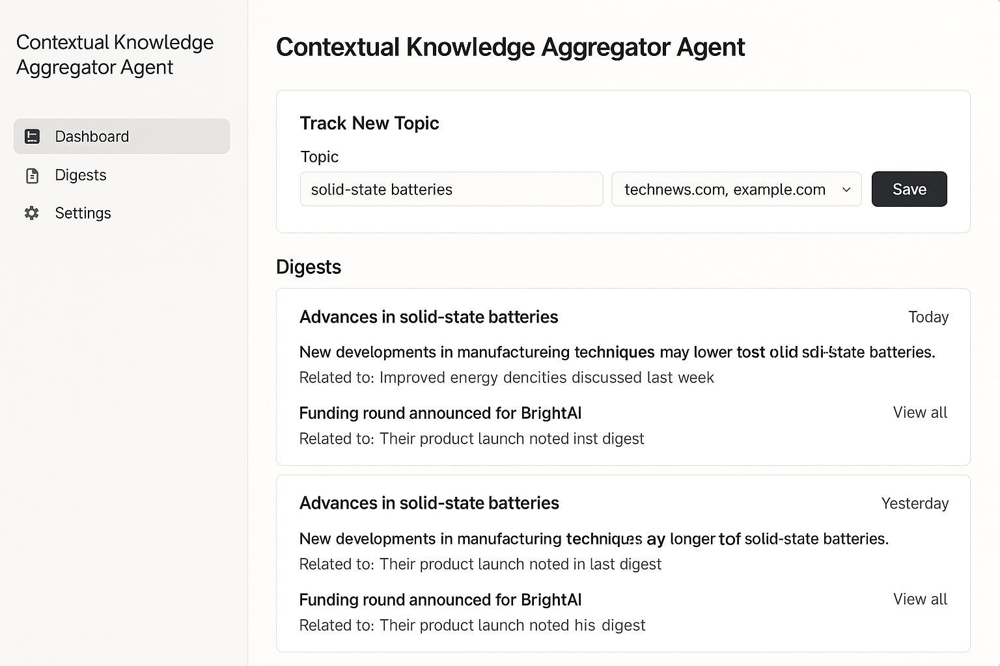
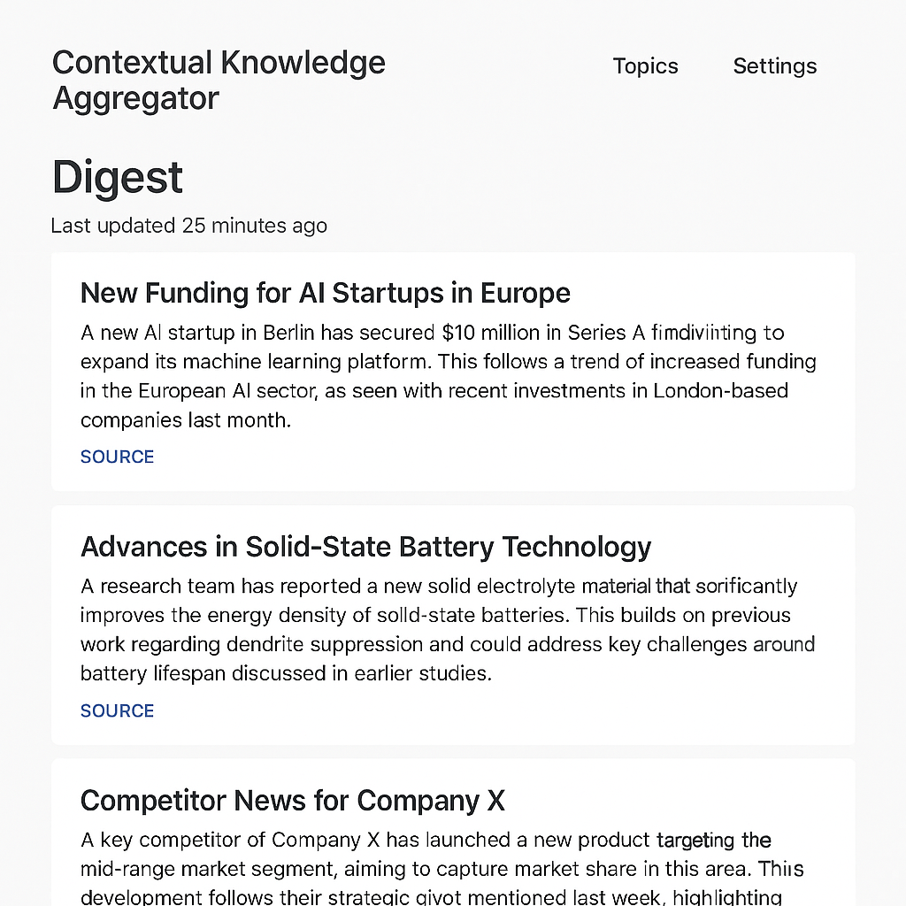
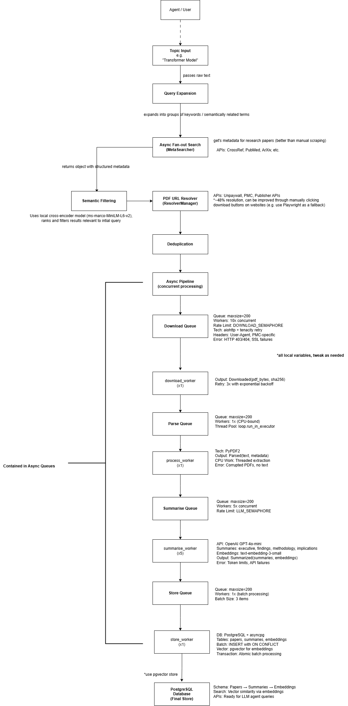

# Research Paper Processing Pipeline

A concurrent pipeline that automatically finds, downloads, processes, and analyzes academic research papers.
Built as a learning project to explore async Python, AI integration, and data processing at scale.

## NOTE:
this is very much a messy testing prototype that I thought I would upload (cos why not)... there are many areas for expansion / improvement.

**Key Use Case**: This pipeline can be integrated with LLM agents to enable autonomous research workflows - where an AI agent can query research topics, process academic literature, and build comprehensive knowledge bases for analysis and decision-making.

## What it does

Takes a research topic (like "creatine for exercise") and:
1. **Searches** multiple academic databases for relevant papers
2. **Downloads** the actual PDFs from various publishers
3. **Extracts** text content from the PDFs
4. **Summarizes** papers using GPT-4 (executive summary, key findings, methodology, implications)
5. **Generates** embeddings for semantic search
6. **Stores** everything in PostgreSQL for later analysis

## Usage Examples

E.g. an adapted version where an agent periodically conducts research, summarising new insights:
### Research Dashboard

### Automated Research Digests
E.g. used for researching latest news, (would be much easier to scrape than research papers)

These mockups show potential interfaces for:
- **Dashboard**: Real-time monitoring of pipeline processing with paper counts, success rates, and processing stages
- **Research Digests**: AI-generated summaries and insights from processed papers, formatted for easy consumption by LLM agents or researchers

## Architecture

### Pipeline Design

The system uses **producer-consumer queues** with **async workers** for concurrent processing:

- **10 concurrent downloaders** - fetch PDFs simultaneously
- **1 text processor** - extracts text using thread pools (CPU-bound)
- **5 concurrent summarizers** - generate AI summaries in parallel
- **1 database writer** - batches inserts for efficiency

**Queues** (max 200 items each) provide backpressure between stages, so if summarization gets slow, downloads automatically throttle.

## LLM Agent Integration

This pipeline is designed to work seamlessly with LLM agents for autonomous research:

- **Agent-driven queries**: An LLM agent can generate research topics and specific queries
- **Knowledge synthesis**: Processed papers become a structured knowledge base for the agent
- **Semantic search**: Embeddings enable the agent to find relevant information quickly
- **Research workflows**: Agents can iteratively refine research based on discovered papers
- **Evidence-based responses**: Agents can cite specific papers and findings in their outputs

## Error Handling

Real-world PDF processing is messy. The pipeline handles:

- **HTTP 403/404** errors from paywalled content
- **SSL certificate** failures
- **Corrupted PDFs** that can't be parsed
- **Token limit** exceeded for very long papers
- **API rate limits** with exponential backoff
- **Database conflicts** from duplicate processing

Failed items are logged but don't crash the pipeline.

## What I Learned

- **Async programming** at scale with proper error handling
- **Pipeline architecture** with backpressure and monitoring
- **AI integration** for content analysis and embeddings
- **Database design** for research data with vector search
- **Real-world data processing** challenges (broken PDFs, rate limits, etc.)

---
